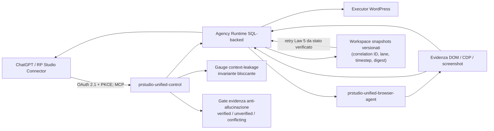

# PR STUDIO Unified Suite 1.0.0 — architettura

La Suite 17 mantiene un solo runtime durevole WordPress e un solo executor Chrome posseduto. ChatGPT entra tramite **RP Studio Connector** sullo stesso endpoint MCP; non esiste un runtime parallelo.

## Identità preservate

- plugin `prstudio-unified-control`, bootstrap `prstudio-unified-control.php`;
- MCP `/wp-json/prstudio-unified/v1/mcp`, pairing `/wp-json/prstudio-unified/v1/pair`;
- estensione `prstudio-unified-browser-agent`, storage `prstudioConfig`;
- wire Browser 3.0.0, accettati 3.0.0/4.0.0;
- opzioni OAuth `prstudio_mcp_v5_clients`, `prstudio_mcp_v5_tokens`, `prstudio_mcp_v5_generation`.

## Contratti 15

La superficie pubblica è di 118 tool tipizzati (incluso
`prstudio_research_radar`; il numero esatto è derivato dal sorgente da
`check-build-info-counts.mjs`). Le 1.376 capability interne non vengono riversate nel contesto del modello: il routing sceglie tool tipizzato, Local Studio esplicito, contratto Browser, azione Browser generica e infine compatibilità legacy. Le 200 capability dirette legacy raggiungono l'executor canonico; 1.076 azioni catalogo mantengono un dispatcher concreto.

`lane_handle` è un identificatore opaco riutilizzabile e OAuth-bound; `lane_token` resta compatibile ma interno/redatto. Un correlation ID server-derived attraversa MCP, coda, Browser e risposta. Online, offline, stale e revoked sono stati distinti.

## Moduli aggiunti il 2026-08-19 (settimana arXiv 13–19 agosto)

Sicurezza e affidabilità LLM (Priorità 1–2):

- `class-prstudio-uc-context-leak-gauge.php` — gauge di context-leakage,
  invariante bloccante applicato in `PRSTUDIO_UC_MCP_V5::clean_result`
  (codice `context_leak_blocked`);
- `class-prstudio-uc-evidence-gate.php` — gate anti-allucinazione sul flusso
  di evidenza (Law 2: verifica come evidenza, mai autorizzazione);
- `class-prstudio-uc-confidence-calibration.php` — calibrazione confidenza
  (ECE, ricalibrazione a bin, verdetto di overconfidence);
- `class-prstudio-uc-style-drift-monitor.php` — drift stilistico output IA;
- `class-prstudio-uc-action-feasibility.php` — pre-check tecnico di
  fattibilità prima di azioni complesse.

Robustezza runtime e audit (Priorità 3–4):

- `class-prstudio-uc-workspace-snapshots.php` — snapshot di sessione
  versionati per correlation ID (backend SQL `prstudio_uc_workspace_snapshots`
  o file), ripristino idempotente e fail-closed su digest;
- `class-prstudio-uc-retry-policy.php` — retry con backoff esponenziale
  jittered e classificazione transitorio/permanente (Law 5);
- `class-prstudio-uc-evidence-memory.php` — memory bank con evidenza
  preservata e diagnostica a doppio loop;
- `class-prstudio-uc-audit-trail.php` — audit trail append-only
  tamper-evident con catena SHA-256;
- `class-prstudio-uc-research-radar.php` — tool MCP `prstudio_research_radar`
  (classificazione paper arXiv sui 6 sottosistemi, digest offline).

Browser Agent:

- `lib/trap-page-policy.js` — policy di contenimento: il contenuto di pagina
  è input non fidato, le azioni derivate dalla pagina senza challenge
  restano in sandbox (Law 4);
- `lib/horizon-stability.js` — stati di evidenza densi, ricaduta a scatto
  singolo su mutazione pagina, replay deterministico.

Oracolo e harness (Law 11):

- `quality/live-acceptance-oracle-rubric.json` + `tests/live-acceptance-oracle.py`
  — oracolo indipendente con rubriche esplicite;
- `bench/tool-surface-harness.py` — conformità schema 100%, copertura
  dispatch, protocollo di varianza/ordine (varianza = 0);
- `tests/security-drift-audit.py` + `quality/security-drift-baseline.json` —
  audit di drift delle superfici di sicurezza.

## Limiti onesti

Il laboratorio visuale prova il test harness, non il tema live. Upgrade WordPress reale, pairing/restart Chrome, OAuth ChatGPT, provider e soak H24 restano prove di accettazione esterne; `production_proven` resta `false`.
