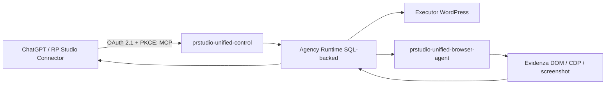

# PR STUDIO Unified Suite 17.0.0 — architettura

La Suite 17 mantiene un solo runtime durevole WordPress e un solo executor Chrome posseduto. ChatGPT entra tramite **RP Studio Connector** sullo stesso endpoint MCP; non esiste un runtime parallelo.

## Identità preservate

- plugin `prstudio-unified-control`, bootstrap `prstudio-unified-control.php`;
- MCP `/wp-json/prstudio-unified/v1/mcp`, pairing `/wp-json/prstudio-unified/v1/pair`;
- estensione `prstudio-unified-browser-agent`, storage `prstudioConfig`;
- wire Browser 3.0.0, accettati 3.0.0/4.0.0;
- opzioni OAuth `prstudio_mcp_v5_clients`, `prstudio_mcp_v5_tokens`, `prstudio_mcp_v5_generation`.

## Contratti 15

La superficie pubblica è di 119 tool tipizzati. Le 1.376 capability interne non vengono riversate nel contesto del modello: il routing sceglie tool tipizzato, Local Studio esplicito, contratto Browser, azione Browser generica e infine compatibilità legacy. Le 200 capability dirette legacy raggiungono l'executor canonico; 1.076 azioni catalogo mantengono un dispatcher concreto.

`lane_handle` è un identificatore opaco riutilizzabile e OAuth-bound; `lane_token` resta compatibile ma interno/redatto. Un correlation ID server-derived attraversa MCP, coda, Browser e risposta. Online, offline, stale e revoked sono stati distinti.

## Limiti onesti

Il laboratorio visuale prova il test harness, non il tema live. Upgrade WordPress reale, pairing/restart Chrome, OAuth ChatGPT, provider e soak H24 restano prove di accettazione esterne; `production_proven` resta `false`.
